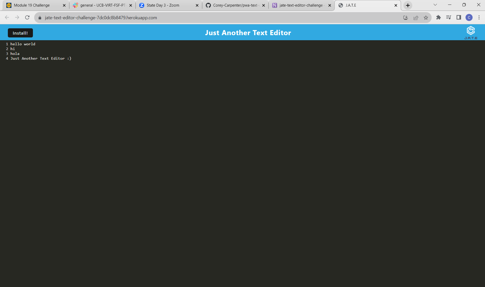

# pwa-text-editor
took webpack config from module 19 mini project and edited it for my app. also pulled registerRoute for service worker.
# PWA Text Editor

## It's just another text editor. A cool little text editor that lets you edit or write whatever.

## Simply open the deployed app on heroku and start typing. 

